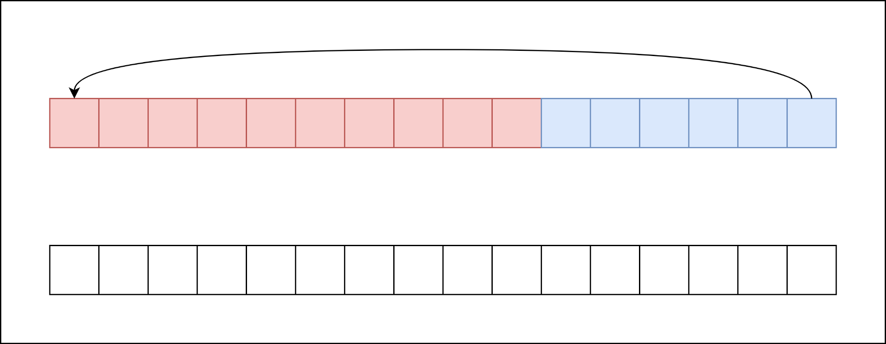
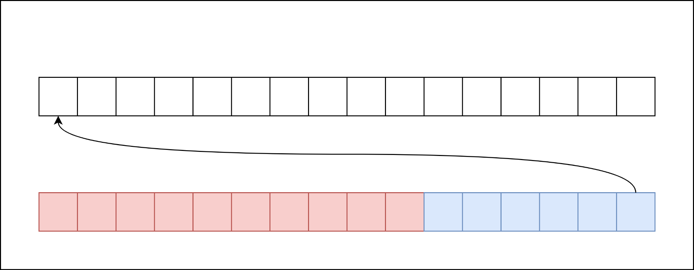

# Tangent - Pin

Pin is weird, but it's easy enough to understand. Let's explore a case study.

## Case Study: `Read`

Let's take for granted that me might want to have an async read function. This
is a reasonable assumption given that async Rust is often used in tandem with async-io.
What might that look like?

Without async, that looks something like

```rust
fn file_read<'f, 'b>(file: &'f File, buf: &'b mut [u8]) -> io::Result<usize> {
    todo!()
}

fn demo<'f>(file: &'f File) {
    let mut buf = [0u8; 1024];
    let n = file_read(file, &mut buf[..]).unwrap();

    let s = String::from_utf8_lossy(&buf[..n]).unwrap();
    println!("{s:?}");
}
```

Maybe with async, we might theorize the API should look something like

```rust
async fn file_read<'f, 'b>(file: &'f File, buf: &'b mut [u8]) -> io::Result<usize> {
    todo!()
}

async fn demo<'f>(file: &'f File) {
    let mut buf = [0u8; 1024];
    let n = file_read(file, &mut buf[..]).await.unwrap();

    let s = String::from_utf8_lossy(&buf[..n]).unwrap();
    println!("{s:?}");
}
```

Let's see what the consequences of this API are.

As discussed previously, Async functions turn into state machines. We don't know the implementation of the `file_read` function, but
the type signature should look something like

```rust
struct FileReadFut<'f, 'b> {
    file: &'f File,
    buf: &'b mut [u8],
    _other_stuff: (),
}
```

We do however know the implemenation of demo, so let's try and put our skills to use and implement a state machine of the demo function.

We have 3 main states:

* Init
* Reading
* Done

between the states, we have some logic:

1. Init -> Reading: we construct a buffer on the stack, and construct our file_read future.
2. Reading -> Done: we parse the bytes as a string and print them

```rust
enum DemoFut<'f> {
    Init {
        file: &'f File,
    }
    Reading {
        buf: [u8; 1024];
        file_read: FileReadFut<'f, 'b>,
    }
    Done
}

impl<'f> Future for DemoFut<'f> {
    type Output = ();

    // ignore pin for now :)
    fn poll(&mut self, cx: &mut Context<'_>) -> Poll<()> {
        loop {
            match *self {
                Self::Init { file } => {
                    let mut buf = [0u8; 1024];
                    let file_read = file_read(file, &mut buf[..]);

                    *self = Self::Reading { buf, file_read };

                    // repeat the loop to process the next state
                    continue;
                }
                Self::Reading { buf, file_read } => {
                    // ready! returns early if the value is Poll::Pending
                    let n = ready!(file_read.poll(cx)).unwrap();

                    let s = String::from_utf8_lossy(&buf[..n]).unwrap();
                    println!("{s:?}");

                    *self = Self::Done;

                    // we are done, so break the loop and return ready
                    break Poll::Ready(());
                }
                Self::Done => panic!("resumed after completion"),
            }
        }
    }
}
```

Is there a problem with this?

---

There's a couple things wrong.

The first is the undefined lifetime in the definition of `DemoFut`. What we want it to borrow from `buf`, but how do we define that?

The second is the related borrow from `buf` after we move `buf` into the state machine.

I am not going to explain how to work around these problems. But we can agree that any such solution would necessitate so-called "self-referential" structs.

---

Let's make another assumption. Assume we can construct a self-referential type that the Rust memory model is happy with. Can we use such a value of
that type the same as any other?



In rust, if you currently have ownership of a value, you can pass ownership somewhere else. This might cause the compiled code to
move the value somewhere else in memory. Maybe we move it to the end of the stack to be passed into a function.

```rust
let mut demo_fut = DemoFut::Init(fut);
let poll = demo_fut.poll(&mut some_context);
assert!(poll.is_pending());

// move the value.
send_somewhere_else(demo_fut);
```



Pin is a system to ensure that these moves cannot happen. This is why we require the Future impl accept `Pin<&mut Self>`.
