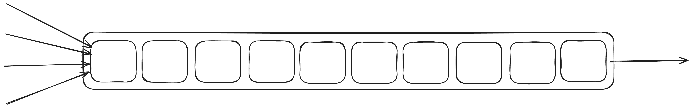

# Tutorial - What is a mpsc channel

A "multi-producer, single-consumer" (mpsc) channel, is a synchronized queue of data.
Many tasks can send data into the queue ("produce" values), and only a single value can
receive data from the queue ("consume" values).



The mpsc channel is the bread and butter of synchronization primitives as it allows efficient sharing of
data between tasks.

Because of the Rust ownership model, you can ergonomically encode the "single consumer" requirement into the type system.
Let's take a peek at the mpsc in std.

```rust
pub fn channel<T>() -> (Sender<T>, Receiver<T>);

impl<T> Sender<T> {
    /// This method will never block the current thread.
    pub fn send(&self, t: T) -> Result<(), SendError<T>>;
}

impl<T> Clone for Sender<T> {}

impl<T> Receiver<T> {
    /// Attempts to wait for a value on this receiver.
    pub fn recv(&mut self) -> Result<T, RecvError>;
}
```

What std doesn't clarify here is that `recv()` will block our runtime thread,
not allowing it to poll other tasks that are also on our thread. This is not great, so let's
figure out how we could possibly make one with support for async code.

Since there's only one function that will wait here, there's only one function that needs to be made async.
That's what we will be looking at soon.
