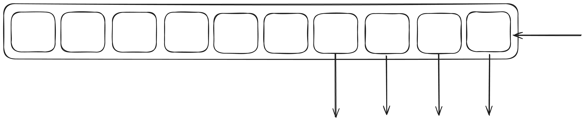

# Chapter 3 - Writing an async mutex

A mutex is a lot like the mpsc channel we just looked at, except the inverse. Much like a channel, it's another
commonly reached tool when it comes to concurrent synchronisation, as you saw we used a mutex in the last project
as it makes mutating state between concurrent tasks trivial.

Unlike a channel, which has one waiter, and multiple concurrent writers. A mutex has multiple waiters and one non-concurrent writer.
We'll focus on fair mutexes, as that offers some strong latency guarantees, as opposed to faster un-fair mutexes. Because of this
fairness requirement, we will need a queue of waiting requests to lock the mutex.

