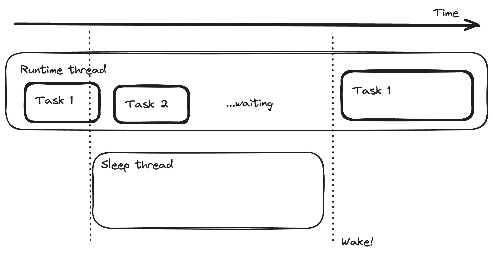
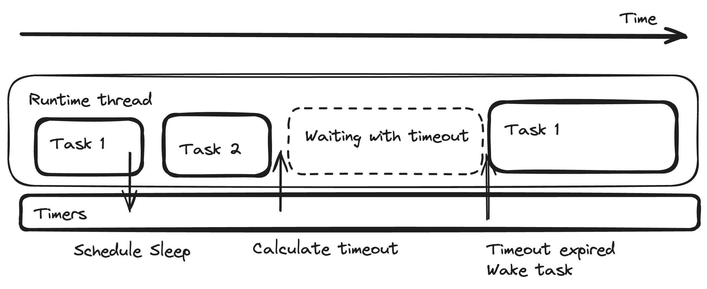

# Chapter 6 - Non-blocking timer runtime

Final task - let's add an asynchronous `sleep` function that makes efficient use of the runtime.

A (not so) trivial async sleep function could work like so:

```rust
async fn sleep(dur: Duration) {
    let deadline = Instant::now() + dur;
    std::future::poll_fn(|cx| {
        let now = Instant::now();

        // check if our deadline has expired
        if deadline <= now {
            return Poll::Ready(());
        }

        // spawn a thread to sleep
        // then to wake up the task later
        let waker = cx.waker().clone();
        std::thread::spawn(move || {
            std::thread::sleep(deadline - now)
            waker.wake()
        });

        // we are waiting
        Poll::Pending
    }).await
}
```



However, can we avoid spawning a thread per sleeping task? Maybe we could fold it into thread parking functionality as well.

---

In the previous tasks, we used `Condvar::wait` to park the thread while idle. Conveniently, there's also
`Condvar::wait_timeout` which allows us to specify a timeout to immediatly exit on. If we know how long until the next task
might wake up, we can calculate such a timeout and pass it to the condvar.

We just need a way to efficiently keep track of all the tasks that might need to wake up. For that, we could
use a min-heap. Rust's standard library offers a max-heap in the form of the `BinaryHeap` struct. It has efficient
random insert, and efficient pop which takes only the maximum value from the heap. With some Ord boilerplate, we can
smuggle a task waker and turn our max-heap into a min-heap over the deadline `Instant`.

```rust
// timers: BinaryHeap<TimerEntry>

struct TimerEntry {
    deadline: Instant,
    waker: Waker,
}

impl PartialEq for TimerEntry {
    fn eq(&self, other: &Self) -> bool {
        self.deadline == other.deadline
    }
}

impl Eq for TimerEntry {}

impl PartialOrd for TimerEntry {
    fn partial_cmp(&self, other: &Self) -> Option<std::cmp::Ordering> {
        Some(self.cmp(other))
    }
}

impl Ord for TimerEntry {
    fn cmp(&self, other: &Self) -> std::cmp::Ordering {
        // BinaryHeap works as a max-heap.
        // We want a min-heap based on deadline, so we should reverse the order.
        self.deadline.cmp(&other.deadline).reverse()
    }
}
```

Now it's your turn to piece this all together


